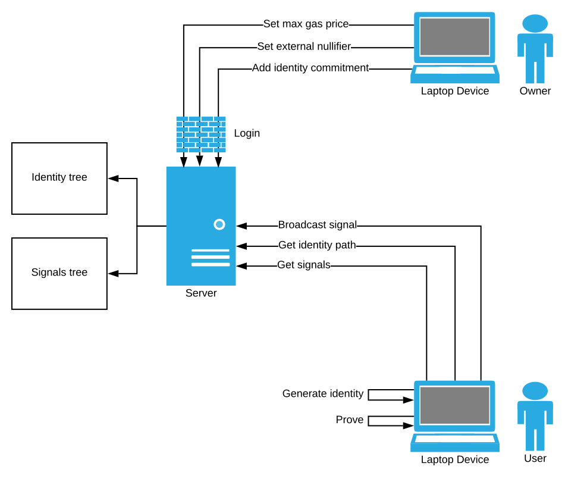

# Semaphore

## Introduction

Semaphore has been introduced by [barryWhiteHat](https://github.com/barryWhiteHat) as a method of zero-knowledge signaling - a method for an approved user to broadcast an arbitrary string without exposing their identity. This repository is an implementation of an upgraded version of the concept, including the zero-knowledge circuits and the tools necessary to use it, both server-side and client-side.

The project is implemented in plain Node.JS and uses [circom](https://github.com/iden3/circom) for the zero-knowledge proofs.

## Design
  Semaphore is comprised of a zkSNARK statement, a few smart contracts, a server application and a client application.

### Smart contracts
Implemented in [**semaphorejs/contracts**](semaphorejs/contracts).

#### Semaphore
  The Semaphore contract is the base layer of Semaphore. Other contracts can build upon this to create applications that rely on anonymous signaling. Semaphore has a tree of allowed identities, a tree of signals, a set of previously broadcast nullifiers hashes, an external nullifier and a gas price refund price:

  * The tree of allowed identities allows a prover to show that they are an identity which is approved to signal.
  * The tree of signals allows a user to verify the integrity of a list of signals.
  * The nullifiers hashes set and external nullifier allows the contract to prevent double signals by the same user, without exposing the specific user.
  * The gas price refund price is a mechanism that supports transaction abstraction - a server can broadcast on behalf of a user to provide further anonymity, and in return they receive a refund and a small reward, with a maximum gas price for their transaction.

The contract allows administrative operations that only the owner is allowed to perform:

  * Managing identities using the **insertIdentity** and **updateIdentity** methods.
  * Setting the **external_nullifier**.
  * Setting the **gas_price_max**.

  The contract allows anyone to read the current state:

  * Reading the roots of the two trees.
  * Reading the current parameters of **external_nullifier** and **gas_price_max**.

  The contract allows anyone to attempt broadcasting a signal, given a signal, a proof and the relevant public inputs.
  The contract allows anyone to fund the contract for gas refund and rewards.

  Lastly, the contract has a few events to allow a server to build a local state to serve users wishing to generate proofs:
    * **Funded** - when the contract has received some funding for refunds and rewards.
    * **SignalBroadcast** - when a signal has been broadcast successfully, after verification of the proof, the public inputs and double-signaling checks.
    * **LeafAdded**, **LeafUpdated** (from MerkleTreeLib) - when the trees have been updated.

#### MerkleTreeLib

  Manages a number of append-only Merkle trees with efficient inserts and updates.

### zkSNARK statement
  Implemented in [**semaphorejs/snark**](semaphorejs/snark).

  The statement assures that given public inputs:
    * **signal_hash**
    * **external_nullifier**
    * **broadcaster_address**
    * **root**
    * **nullifiers_hash**
  and private inputs:
    * **identity_pk**
    * **identity_nullifier**
    * **identity_r**
    * **identity_path_elements**
    * **identity_path_index**
    * **auth_sig_r**
    * **auth_sig_s**

  the following conditions hold:

  * The commitment of the identity structure (**identity_pk**, **identity_nullifier**, **identity_r**) exists in the identity tree with the root **root**, using the path (**identity_path_elements**, **identity_path_index**). This ensures that the user was added to the system at some point in the past.
  * **nullifiers_hash** is uniquely derived from **external_nullifier** and **identity_nullifier**. This ensures a user cannot broadcast a signal with the same **external_nullifier** more than once.
  * The message (**external_nullifier**, **signal_hash**, **broadcaster_address**) is signed by the secret key corresponding to **identity_pk**, having the signature (**auth_sig_r**, **auth_sig_s**). This ensures that the user approves the signal broadcast by a specific **broadcaster_address**, preventing front-running attacks, and a specific state of the contract having a specific **external_nullifier**, ensuring no double-signaling.

#### Cryptographic primitives

Semaphore uses a few cryptographic primitives provided by circomlib:

* MiMCHash for the Merkle tree, the identity commitments and the message hash in the signature.
* EdDSA for the signature.

Note: MiMCHash, and especially the specific paramteres used in the circuit, have not been heavily audited yet by the cryptography community. Additionally, the circuit and code should also receive further review before relying on it for production applications.

### Server

Implemented in [**semaphorejs/src/server/server.js**](semaphorejs/src/server/server.js). Acts as a manager of the identities merkle tree and as an identity onboarder. The REST API allows:

        * An owner to submit a transaction that adds an identity to the merkle tree, provided proper authentication.
        * A client to ask for a path from an identity commitment to the current root of the tree, relieving the client from the need to manage this tree by themselves.
        * A client to ask a list of signals, together with their paths to the signals tree root.
        * An owner to set the external nullifier.
        * An owner to set the max gas price.

The server relies on an Ethereum node and the events in the smart contract to synchronize to the current state and handle rollbacks if they occur.

It uses [**sbmtjs**](sbmtjs) - *storage-backed merkle tree*. Semaphore requires managing a growing merkle tree containing the identities allowed to signal and the signals broadcast by users. sbmtjs manages the trees using a database, making the tree scale by the disk size.

### Client

Implemented in [**src/client/client.js**](semaphorejs/src/client/client.js). Enables signaling a user's support of an arbitrary statemnt, given identity secrets of an identity existing in the tree. The client has 2 CLI functions:

      * **generate_identity** - generate random identity secrets and randomness, save them to disk and print the identity commitment. The client can then send the commitment to the onboarder (using another channel), requesting they add them to the tree.
      * **signal STRING** - given an arbitrary string, generates a zero-knowledge proof of the client's authorization to signal. The signalling requests the path of the identity commitment from the server, and broadcasts the transaction directly to the contract.

### Web

A web interface to run the server and client APIs, generate identities and proofs directly in the browser and broadcast signals.

## Running modes

Schematically, Semaphore has the following actors:

There are 3 main running modes:

* One server is the owner of the Semaphore contract, other servers act as intermediate miners and clients uses them to broadcast their signals. This the lightest running mode for clients, as they rely on servers to provide them with tree paths, a list of signals and broadcast. This is the default mode that is exposed in the CLI and web clients.
* One server is the owner of the Semaphore contract and clients broadcast directly. This is still a light running mode for clients, and is less prone to server censorship, at the cost of less anonymity - as the user's Ethereum address is exposed.
* One server is the owner of the Semaphore contract and clients run a server locally. This is a heavier running mode, allowing the clients to run autonomously, reconstructing the signals and identities states locally.

## Configuration

The server and the client look for **server-config.json** and **client-config.json**, respectively. They can also accept their configuration as environment variables:
* **server**:
    * CONFIG_ENV - load configuration from environment variables rather than a file.
    * CONFIG_PATH - location of the configuration file.
    * LOG_LEVEL - error, info, debug or verbose.
    * DB_PATH - location of the RocksDB database.
    * CHAIN_ID - chain ID of the Ethereum network.
    * CONTRACT_ADDRESS - the deployed Semaphore contract address.
    * CREATION_HASH - the transaction hash in which the contract was created, to allow for faster initial sync.
    * NODE_URL - the RPC URL of the Ehtereum node.
    * SEMAPHORE_PORT - the port on which to serve the Semaphore server REST API.
    * SEMAPHORE_LOGIN - the password with which clients communicating with the Semaphore server REST API must authenticate.
    * FROM_ADDRESS - the address to send transactions from.
    * FROM_PRIVATE_KEY - the private key of FROM_ADDRESS.
    * TRANSACTION_CONFIRMATION_BLOCKS - the amount of blocks to wait until a transaction is considered confirmed. The default is 24.
* **client:**
    * CONFIG_ENV - load configuration from environment variables rather than a file.
    * LOG_LEVEL - error, info, debug or verbose.
    * IDENTITY_PATH - location of the identity secrets file.
    * CHAIN_ID - chain ID of the Ethereum network.
    * CONTRACT_ADDRESS - the deployed Semaphore contract address.
    * NODE_URL - the RPC URL of the Ehtereum node.
    * FROM_ADDRESS - the address to send transactions from.
    * FROM_PRIVATE_KEY - the private key of FROM_ADDRESS.
    * TRANSACTION_CONFIRMATION_BLOCKS - the amount of blocks to wait until a transaction is considered confirmed. The default is 24.
    * EXTERNAL_NULLIFIER - the external nullifier to be used with the signal. Must match the one in the contract.
    * SEMAPHORE_SERVER_URL - the URL of the Semaphore REST server.
    * BROADCASTER_ADDRESS - the address of the Semaphore server that will be allowed to broadcast the client's signals.

## Running

* The easiest way to try Semaphore out is running:
  * **npm install**
  * **cd scripts && ./compile.sh && ./do_setup.sh && ./build_verifier.sh** - compile, do a setup and build the verifier of the Semaphore circuit.

  * **scripts/run_ganache.sh** - runs ganache with appropriate parameters for Semaphroe testing.
  * **scripts/run_all_test.sh** - runs a server and a client, generates a new random identity and broadcasts a signal.

It assumes bash, node and truffle are globally available.

Examples of run commands (roughly matching the test contract deployed on Rinkeby):
* `LOG_LEVEL=debug CHAIN_ID=4 CONTRACT_ADDRESS=0x3dE2c3f8853594440c3363f8D491449Defa0bE1F NODE_URL=https://rinkeby.infura.io/v3/f4a3ad81db3f4750bd201955c8d20066 SEMAPHORE_PORT=3000 FROM_ADDRESS=0x1929c15f4e818abf2549510622a50c440c474223 FROM_PRIVATE_KEY=0x6738837df169e8d6ffc6e33a2947e58096d644fa4aa6d74358c8d9d57c12cd21 TRANSACTION_CONFIRMATION_BLOCKS=1 CREATION_HASH=0x4d6998f49f3ebb6e2bd3567c5adbf3f5ab711fbb24e618b4b53498d521f9c758 SEMAPHORE_LOGIN=test123 CONFIG_ENV=true npx semaphorejs-server`
* `LOG_LEVEL=debug TRANSACTION_CONFIRMATION_BLOCKS=1 CHAIN_ID=4 CONTRACT_ADDRESS=0x3dE2c3f8853594440c3363f8D491449Defa0bE1F NODE_URL=https://rinkeby.infura.io/v3/f4a3ad81db3f4750bd201955c8d20066 EXTERNAL_NULLIFIER=12312 SEMAPHORE_SERVER_URL=https://semaphore-server.kobi.one BROADCASTER_ADDRESS=0x1929c15f4e818abf2549510622a50c440c474223 CONFIG_ENV=true npx semaphorejs-client signal "I vote for fork A"`
