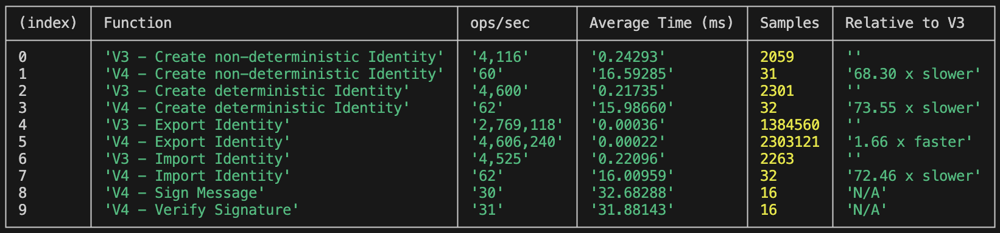
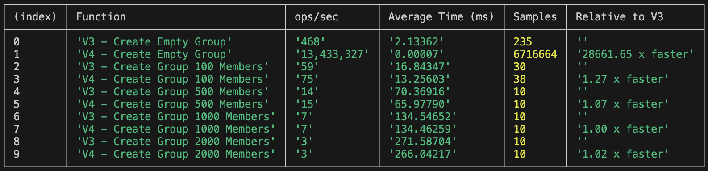
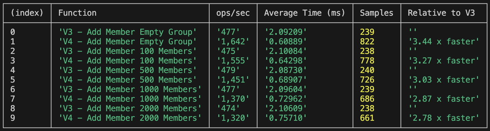
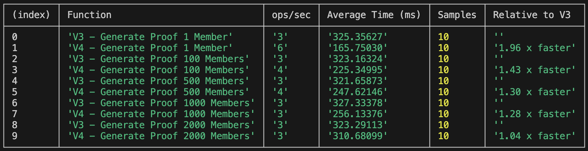
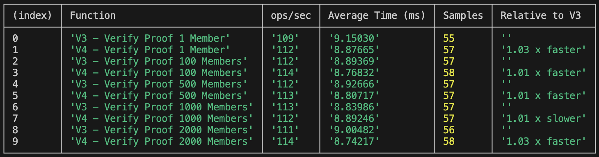
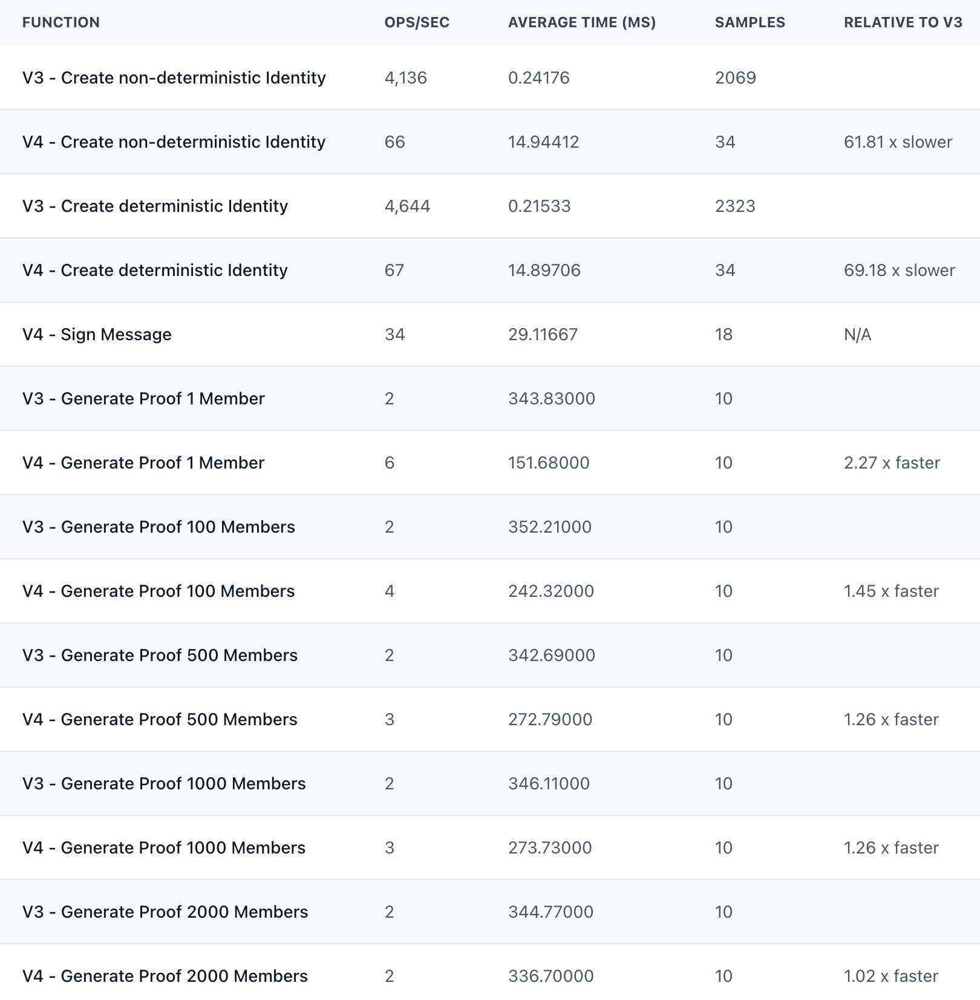
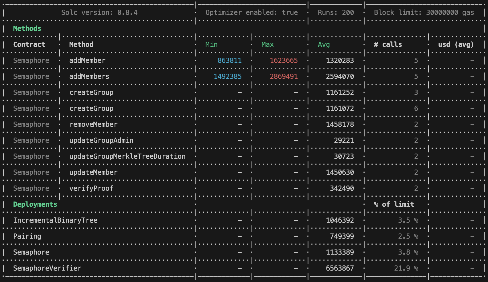
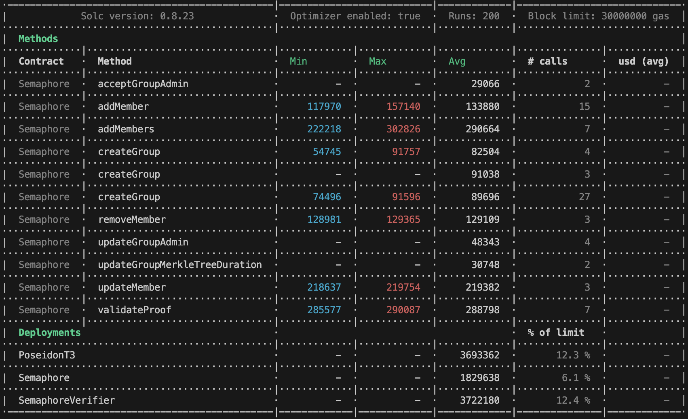

# Benchmarks

Semaphore v4 introduces new features and performance improvements. Detailed changes are available in the [release changelog](https://github.com/semaphore-protocol/semaphore/releases/tag/v4.0.0).

The primary changes in benchmark values are driven by the two major protocol updates:

-   New [Identity schema](https://github.com/semaphore-protocol/semaphore/tree/main/packages/identity).

-   [LeanIMT](https://github.com/privacy-scaling-explorations/zk-kit/tree/main/packages/lean-imt): New optimized IMT.

## New Identity schema

Semaphore v4 includes a new schema for the identities allowing the creation and verification of signatures.

Although the new Identity package is slightly slower than the one in Semaphore v3 (by just a few milliseconds), the trade-off is minimal considering the included functionality.

The new identity schema adds additional constraints to the Semaphore v4 circuit; however, this does not negatively impact overall performance of the protocol.

## LeanIMT

Semaphore v4 uses the LeanIMT data structure for group operations, an improvement over the IMT used in v3.

For further details, see the [LeanIMT paper](https://github.com/privacy-scaling-explorations/zk-kit/tree/main/papers/leanimt).

The LeanIMT offers dynamic depth, resulting in faster and more cost-effective group operations, across Node.js, browser and smart contracts.

Semaphore v4 support tree depths from 1 to 32, while v3 supports depths from 16 to 32, both for proof generation and verification.

## System Specifications and Software environment

All the benchmarks were run in an environment with these properties:

**System Specifications**

Computer: MacBook Pro

Chip: Apple M2 Pro

Memory (RAM): 16 GB

Operating System: macOS Sequoia version 15.6.1

**Software environment**

Node.js version: 23.10.0

Browser: Google Chrome Version 139.0.7258.156 (Official Build) (arm64)

## Running the benchmarks

### Javascript and Circom

GitHub repository to the run Node.js, browser and Circom benchmarks: https://github.com/vplasencia/semaphore-benchmarks

### Solidity

GitHub repository to run the Solidity benchmarks: https://github.com/semaphore-protocol/semaphore

## Node.js benchmarks

### Identities

### Create Group

Create group, either empty or with initial members.

### Add Member

Add a member to groups with different sizes.

### Generate Proof

Generate a proof using groups with different numbers of members.

### Verify Proof

Verify a proof using groups with different numbers of members.

## Browser benchmarks

Main functions used in the browser.

## Circuit benchmarks

Tree depth = 20

### Semaphore V3

### Semaphore V4

## Contracts

### Semaphore V3 gas report

### Semaphore V4 gas report

